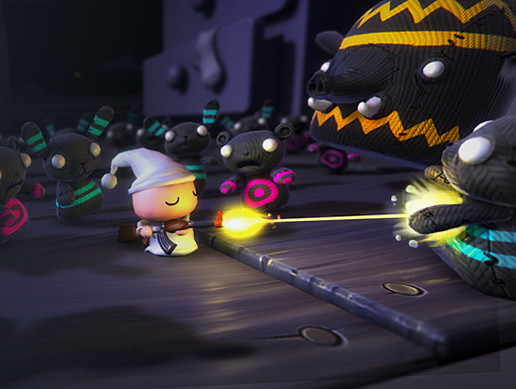
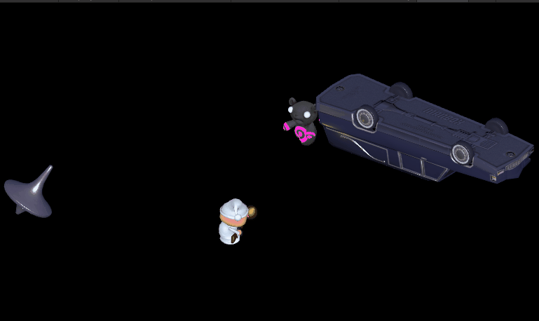

# :gun: Unity Survival Shooter Machine Learning Agent

## About
**Unity Survival Shooter Machine Learning Agent** is an implementation of reinforcement learning in an old basic Unity tutorial project for beginners.

The basic project was downloaded from [here](https://unitylist.com/p/gbc/Unity3D-Survival-Shooter). I upgraded the original project from Unity version 2018.2.8f1 to 2021.1.25f1. The game is a top-down shooter in a cute environment. The player needs to shoot different kind of enemies to insure its protection.

The **Unity ML Agent** takes possession of the player and controls it.

## Contents
1. [Environment](#environment)
2. [Getting started](#getting-started)
3. [Reward System](#reward-system)
4. [Observation Space](#observation-space)
5. [Action Space](#action-space)
6. [How it was trained](#how-it-was-trained)
7. [Fun facts](#fun-facts)
8. [Disclaimers](#disclaimers)

## Environment
* Python 3.7.9
* PyTorch 1.9.1 `pip install torch~=1.9.1 -f https://download.pytorch.org/whl/torch_stable.html`
* ML Agents 0.27.0 python package `pip install mlagents`
* ML Agents unity package (I installed pre-released version 2.0.0 from the package manager)

## Getting Started

### Play the game

To play the original game, open the `Level01` scene and just hit play. 

### Watch the agent in action

To see the trained agent in action, open the `Level01_trained_agent` scene. Make sure that the component `BehaviorParameters` on the gameObject `Player_Agent` has its `BehaviorType` set to `Inference Only` and has its `Model` set to a brain (in my case, the trained brain I use is `Shooter.onnx` in `Assets/Brains`).

Hit play and watch the results.

### Train the agent

To train the agent, open the `Level01_agent` scene. 

1. Set the `BehaviorType` of the agent to `Default`
2. Open a Command Prompt at the project root
3. Type `mlagents-learn config/shooter.yaml --run-id=shooter --time-scale=7`
4. Hit play in the editor

**To speed up the training**, there are 9 training environments in the `Level01_agent` scene. Feel free to add or remove training environments depending on your system performance. The Unity time scale is also set to `7` to speed up the training.

**Enjoy the training !** :brain:

**Note:** `time-scale` parameter is set to `7` instead of the default `20` since NavMeshAgents are laggy with a high time scale.

## Reward System
The agent learns by given it rewards and punishments. This is how it is rewarded:

1. The agent gets `1f` per kill
2. The agent gets `0.1f` per enemy hit by a shot
3. The agent gets `-0.1f` per missed shots
4. The agent gets `-1f` per damage it is given
5. The agent gets `-5f` when it is killed
6. The agent gets a small reward per update for staying alive 

## Observation Space

As observations, the agent has a `RayPerceptionSensor3D` component attached to it which detects ennemies and the map elements in its surroundings.

## Action Space

### Continuous Actions

1. Horizontal Movement
2. Vertical Movement
3. Rotation X
4. Rotation Z

### Discrete Action

1. Should the agent shoot? (Size of 2 (0, 1))

## How it was trained

I started the training with **imitation learning**. I set the `BehaviorType` to `Heuristic` and added a `DemonstrationRecorder` to record a demonstration. To not waste much time with playing and recording, I cheated by adding an aimbot option to the agent to make it able to perfectly shoot the closest target.

When I felt the agent was starting to understand its tasks, I removed the imitation training and added **curriculum learning** with different levels of complexity for the agent. From lessons to lessons, the enemy spawn rates were shorter and shorter.

I considered the training over when the agent reached the last lesson of the curriculum learning.

Here are the **final results**:

Some runs were going over 8000 points.

## Fun facts

### Spawn Kill

To maximize its score, the agent took the habit to spawn kill its enemies.

## Disclaimers

* I do not own the original project, the project is from [Unity Learn](https://learn.unity.com/project/survival-shooter-tutorial).
* Since the original project was not intended to have an implementation of ML Agents, I had to make workarounds and I did not used the best programming practices to plug in a ML agent.